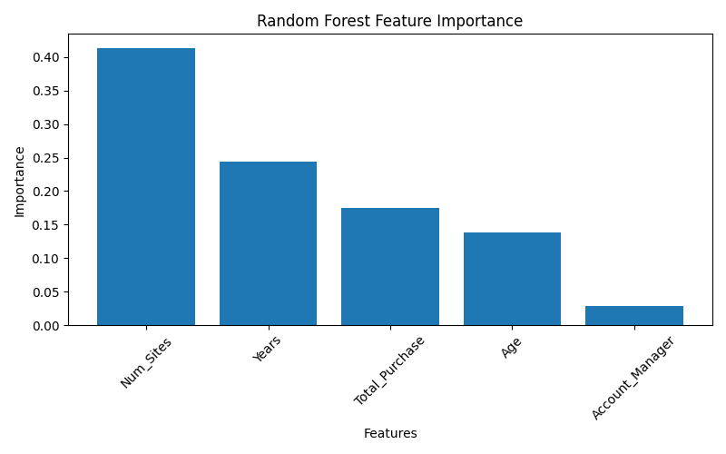

# Customer Churn Prediction — Machine Learning Classification

## Project Overview

This project is developed as part of the **GIST ML Internship — Task 2: Machine Learning Classification**.

The goal of this project is to build a machine learning classification system that predicts whether a customer is likely to **churn (leave the company)** or **stay**.

Two machine learning algorithms are implemented and compared:

- Logistic Regression
- Random Forest Classifier

The models are evaluated using Accuracy, Precision, Recall, F1 Score, ROC-AUC, Confusion Matrix, and Classification Report.

---

## Objectives

- Analyze a real-world customer churn dataset.
- Perform data exploration and preprocessing.
- Select relevant features for prediction.
- Train multiple classification algorithms.
- Compare model performance.
- Identify the better-performing model.
- Analyze important features affecting customer churn.

---

## Project Structure

```text
Task-2-Customer-Churn/
│
├── data/
│   └── customer_churn.csv
│
├── churn_prediction.py
├── requirements.txt
├── model_comparison.csv
├── feature_importance.png
├── screenshots/
│   ├── 01_data_analysis.png
│   ├── 02_logistic_regression.png
│   ├── 03_random_forest.png
│   ├── 04_final_result.png
│   └── 05_model_comparison.png
│
├── .gitignore
└── README.md
````

---

## Dataset

The dataset contains **900 customer records** and **10 columns**.

### Features

| Feature         | Description                                  |
| --------------- | -------------------------------------------- |
| Names           | Customer name                                |
| Age             | Customer age                                 |
| Total_Purchase  | Total customer purchase amount               |
| Account_Manager | Account manager information                  |
| Years           | Number of years as a customer                |
| Num_Sites       | Number of sites associated with the customer |
| Onboard_date    | Customer onboarding date                     |
| Location        | Customer location                            |
| Company         | Customer company                             |
| Churn           | Target variable                              |

### Target Variable

`Churn`

* `0` → Customer stays
* `1` → Customer churns

### Class Distribution

* **750** non-churned customers
* **150** churned customers

---

## Technologies Used

* Python
* Pandas
* NumPy
* Matplotlib
* Scikit-learn
* VS Code
* Git
* GitHub

---

## Machine Learning Workflow

```text
Dataset
   ↓
Data Exploration
   ↓
Data Validation
   ↓
Feature Selection
   ↓
Train/Test Split
   ↓
Feature Scaling
   ↓
Model Training
   ↓
Model Evaluation
   ↓
Model Comparison
   ↓
Feature Importance Analysis
```

---

## Machine Learning Models

### 1. Logistic Regression

Logistic Regression was used as a baseline classification algorithm.

A `StandardScaler` was applied to standardize the numerical features before training.

### 2. Random Forest Classifier

Random Forest is an ensemble machine learning algorithm that combines multiple decision trees to make predictions.

The model was configured with balanced class weights to handle the imbalance between churned and non-churned customers.

---

## Model Evaluation

The models were evaluated using:

* Accuracy
* Precision
* Recall
* F1 Score
* ROC-AUC
* Confusion Matrix
* Classification Report

### Model Comparison

| Model               | Accuracy | Precision | Recall |   F1 Score |    ROC-AUC |
| ------------------- | -------: | --------: | -----: | ---------: | ---------: |
| Logistic Regression |   90.56% |    80.95% | 56.67% | **66.67%** | **91.33%** |
| Random Forest       |   86.67% |    66.67% | 40.00% |     50.00% |     88.99% |

---

##  Best Model

Based on the **F1 Score and ROC-AUC**, Logistic Regression performed better than Random Forest on this dataset.

### Logistic Regression Results

* Accuracy: **90.56%**
* Precision: **80.95%**
* Recall: **56.67%**
* F1 Score: **66.67%**
* ROC-AUC: **91.33%**

---

##  Feature Importance

Random Forest feature importance was used to identify the most influential features.

| Feature         | Importance |
| --------------- | ---------: |
| Num_Sites       |     0.4140 |
| Years           |     0.2436 |
| Total_Purchase  |     0.1751 |
| Age             |     0.1385 |
| Account_Manager |     0.0288 |

The results indicate that **Num_Sites** was the most important feature among the selected variables.

### Feature Importance Visualization



---

## Confusion Matrix

### Logistic Regression

```text
[[146   4]
 [ 13  17]]
```

### Random Forest

```text
[[144   6]
 [ 18  12]]
```

---

## How to Run the Project

### 1. Clone the Repository

```bash
git clone https://github.com/AtiyaQazi/GIST-ML-Task-2-Customer-Churn.git
```

### 2. Open the Project Directory

```bash
cd GIST-ML-Task-2-Customer-Churn
```

### 3. Create a Virtual Environment

```bash
python -m venv venv
```

### 4. Activate the Virtual Environment

For Windows PowerShell:

```powershell
venv\Scripts\Activate.ps1
```

### 5. Install Dependencies

```bash
pip install -r requirements.txt
```

### 6. Run the Project

```bash
python churn_prediction.py
```

---

## Generated Files

The project generates the following files:

* `model_comparison.csv` — model performance comparison.
* `feature_importance.png` — Random Forest feature importance visualization.

---

## Screenshots

Screenshots demonstrating the project execution and results are included in the `screenshots` folder.

The screenshots demonstrate:

1. Dataset analysis
2. Logistic Regression results
3. Random Forest results
4. Final Result.png
5. Model comparison
---

## Conclusion

This project demonstrates the application of machine learning classification algorithms to a real-world customer churn prediction problem.

Two algorithms, **Logistic Regression** and **Random Forest**, were trained and evaluated.

Logistic Regression achieved better overall performance, with an **Accuracy of 90.56%**, **F1 Score of 66.67%**, and **ROC-AUC of 91.33%**.

The feature importance analysis also showed that **Num_Sites**, **Years**, and **Total_Purchase** were among the most influential features for predicting customer churn.

---

## Author

**Attia Qamar-un-nisa**


